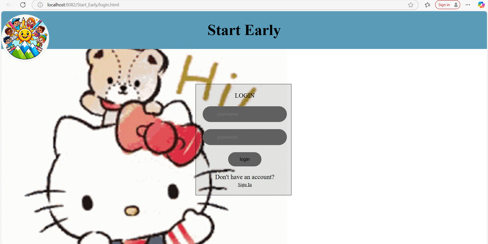
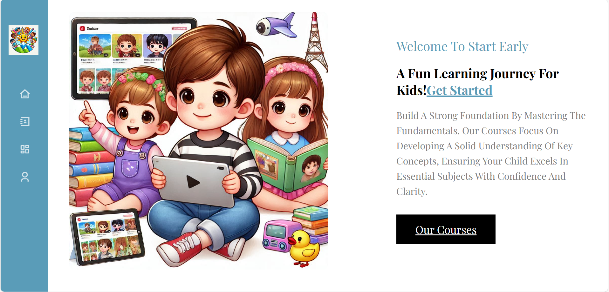
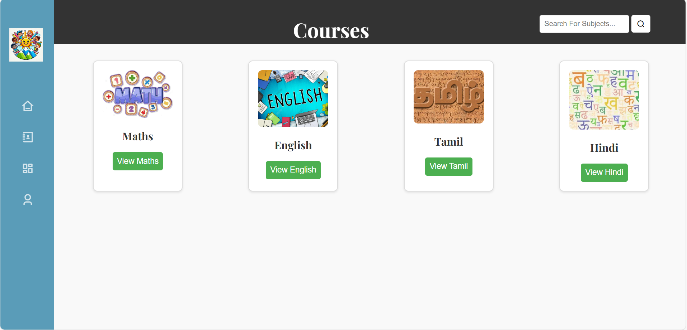
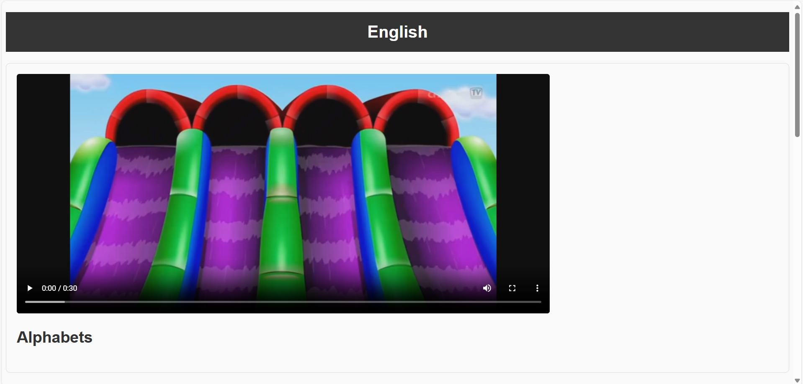
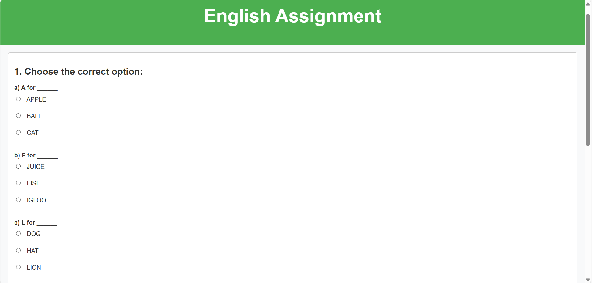
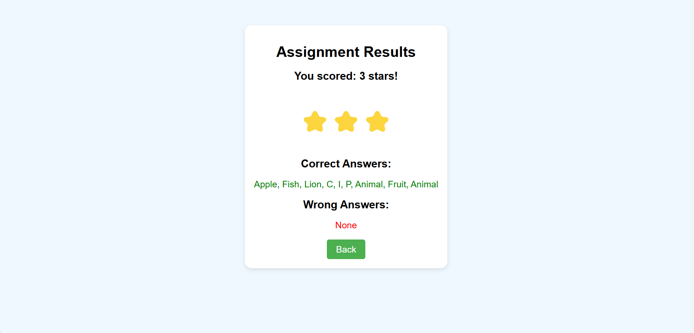
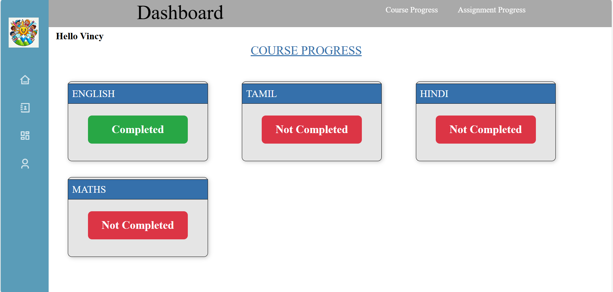
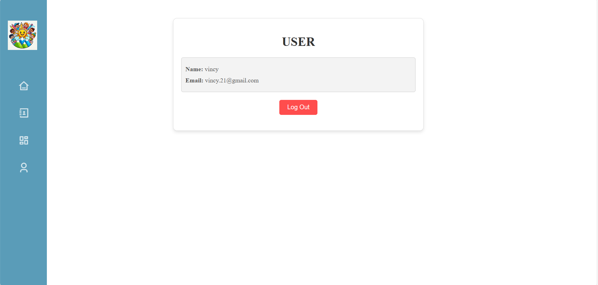

# Start Early – Preschool Educational Web Application 🧠📚🌟

**Start Early** is an interactive and child-friendly **educational web application** designed to help preschool children learn foundational concepts through **videos, assignments**, and **playful engagement**. The platform supports both **learning** and **progress tracking**, making early education accessible and fun.

---

## 🔧 Technologies Used

- **Frontend**: HTML5, CSS3  
- **Backend**: Java (Servlets)  
- **Database**: MySQL  
- **Web Server**: Apache Tomcat v10.1  
- **IDE**: Eclipse IDE 2024  
- **JDBC Driver**: MySQL Connector/J

---

## 🌟 Key Features

- 👶 **Preschool-Friendly Interface**  
  Visually engaging and easy-to-use interface suitable for young learners.

- 📺 **Video Lessons by Subject**  
  Subjects include English, Math, Science, and Tamil — each with a curated educational video.

- 📝 **One Assignment per Subject**  
  Interactive assignments for each subject, auto-evaluated with instant results.

- 🟢 **Progress Tracking**  
  Dashboard displays course and assignment completion status with visual indicators.

- 🌟 **Star-Based Performance System**  
  Children are rewarded stars based on correct answers to encourage participation.

- 📂 **History Tracking**  
  Keeps a record of watched videos and completed assignments.

- 🔊 **Sound Effects and Animations**  
  Enhanced user experience with playful audio and visual feedback during assessments.

---

## 📸 Screenshots

